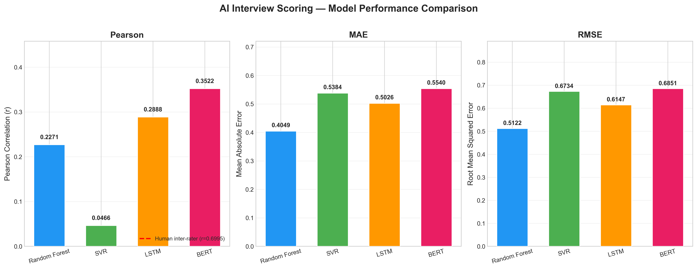
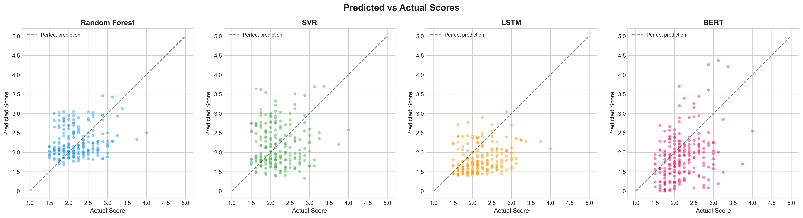

<div align="center">

# AI Interview Answer Scoring

**Evaluating the Reliability of AI-Driven Scoring for Written Interview Responses**

[](https://www.python.org/)
[](https://pytorch.org/)
[](https://www.tensorflow.org/)
[](https://huggingface.co/)
[](LICENSE)

</div>

---

## Abstract

This repository presents a reproducible machine learning pipeline that investigates whether AI models can evaluate written interview responses with reliability comparable to human interviewers. We train four NLP models — **Random Forest**, **SVR**, **Bi-LSTM**, and **BERT** — on a large-scale corpus of scored textual responses and evaluate their agreement with human evaluator scores on real interview data.

Our findings demonstrate that **BERT achieves the highest correlation with human scores (Pearson r = 0.3522, p < 0.0001)**, providing statistically significant evidence that transformer-based models can learn meaningful scoring patterns from textual responses. The study also establishes a human inter-rater reliability baseline (r = 0.6995) for contextual comparison.

---

## Key Results

### Regression Metrics

| Model         | Pearson r  |   p-value    |    MAE     |    RMSE    |
| :------------ | :--------: | :----------: | :--------: | :--------: |
| Random Forest |   0.2271   |    0.0006    | **0.4049** | **0.5122** |
| SVR           |   0.0466   |    0.488     |   0.5384   |   0.6734   |
| Bi-LSTM       |   0.2888   |   1.1e-05    |   0.5026   |   0.6147   |
| **BERT**      | **0.3522** | **< 0.0001** |   0.5540   |   0.6851   |

**Human Inter-Rater Reliability:** Pearson r = 0.6995 (p < 0.0001, N = 224)

### Classification Accuracy Matrix

> Continuous scores discretized to integer classes (1–5) via rounding; Precision, Recall, and F1 are weighted averages.

| Model             | Accuracy   | Precision  | Recall     | F1 Score   |
| :---------------- | :--------: | :--------: | :--------: | :--------: |
| **Random Forest** | **0.6830** | **0.6965** | **0.6830** | **0.6892** |
| SVR               |   0.5848   |   0.6626   |   0.5848   |   0.6202   |
| Bi-LSTM           |   0.6161   |   0.6654   |   0.6161   |   0.6242   |
| BERT              |   0.4955   |   0.6808   |   0.4955   |   0.5715   |

<p align="center">
  
</p>

---

## Project Structure

```
ai-interview-scoring/
├── run_pipeline.py                  # Master pipeline orchestrator
├── requirements.txt                 # Python dependencies
├── README.md
├── LICENSE
│
├── src/
│   ├── setup_project.py             # Step 1: Directory setup
│   ├── data_preprocessing/
│   │   ├── __init__.py
│   │   ├── load_data.py             # Step 2: Dataset loaders (Essay, Short Answer, Interview)
│   │   ├── clean_text.py            # Step 3: NLP text cleaning pipeline
│   │   └── split_data.py            # Step 6: Train/test matrix construction
│   ├── feature_engineering/
│   │   ├── __init__.py
│   │   ├── features.py              # Step 4: Linguistic, readability & sentiment features
│   │   └── embeddings.py            # Step 5: Sentence-BERT embeddings (384-d)
│   ├── models/
│   │   ├── __init__.py
│   │   ├── random_forest.py         # Step 7: Random Forest with RandomizedSearchCV
│   │   ├── svr_model.py             # Step 8: SVR with RBF kernel tuning
│   │   ├── lstm_model.py            # Step 9: Bidirectional LSTM (Keras)
│   │   └── bert_model.py            # Step 10: BERT fine-tuning for regression
│   └── evaluation/
│       ├── __init__.py
│       ├── compare_models.py        # Step 11: Metrics aggregation, charts & report
│       └── classification_metrics.py # Step 12: Classification accuracy matrix
│
├── results/
│   ├── figures/                     # Generated visualisations
│   └── tables/                      # Metrics JSON, comparison CSV, LaTeX tables, summary report
│
├── data/                            # Raw & processed data (gitignored)
├── training_data/                   # Source datasets (gitignored)
└── testing_data/                    # Interview evaluation XLSX files (gitignored)
```

---

## Methodology

### Datasets

| Dataset              | Source                | Samples |    Score Range     |   Role   |
| :------------------- | :-------------------- | ------: | :----------------: | :------: |
| ASAP Essay Scoring   | Kaggle                | ~12,976 |  1–5 (normalized)  | Training |
| Short Answer Grading | Kaggle                |    ~297 |    1–5 (mapped)    | Training |
| Interview Responses  | Custom (2 evaluators) |     224 | 1–5 (criteria avg) | Testing  |

### Feature Engineering

- **12 Handcrafted Features:** Word count, sentence count, lexical diversity, Flesch Reading Ease, Flesch-Kincaid Grade, Gunning Fog, ARI, VADER sentiment (4 scores)
- **384-d Sentence Embeddings:** `all-MiniLM-L6-v2` (Sentence-BERT)
- **Total Feature Vector:** 396 dimensions (standardized, fit on training data only)

### Models

1. **Random Forest** — Ensemble baseline with 30-iteration RandomizedSearchCV (5-fold CV)
2. **SVR** — Support Vector Regression with RBF kernel, hyperparameter tuning
3. **Bi-LSTM** — Bidirectional LSTM with Huber loss, sigmoid output scaled to [1, 5], early stopping
4. **BERT** — `bert-base-uncased` fine-tuned for regression with gradient accumulation, AdamW optimizer, linear scheduler

### Evaluation

- **Pearson Correlation Coefficient** — Primary metric (agreement with human scores)
- **MAE / RMSE** — Error magnitude metrics
- **Classification Metrics** — Accuracy, Precision, Recall, F1 Score (weighted avg) on discretized score classes
- **Inter-Rater Reliability** — Human evaluator A vs B correlation as the baseline

---

## Quick Start

### 1. Clone the Repository

```bash
git clone https://github.com/vedant-kumbhar-13/ai-interview-scoring.git
cd ai-interview-scoring
```

### 2. Set Up Virtual Environment

```bash
python -m venv myenv

# Windows
myenv\Scripts\activate

# Linux/macOS
source myenv/bin/activate
```

### 3. Install Dependencies

```bash
pip install -r requirements.txt
```

> **GPU Support (Recommended):** For CUDA-enabled PyTorch, install separately:
>
> ```bash
> pip install torch torchvision torchaudio --index-url https://download.pytorch.org/whl/cu124
> ```

### 4. Prepare Data

Place your datasets in:

- `training_data/archive (1)/` — Essay scoring TSV
- `training_data/archive (3)/` — Short answer grading CSVs
- `testing_data/` — Interview evaluation XLSX files

### 5. Run the Pipeline

```bash
# Full pipeline (all 12 steps)
python run_pipeline.py

# From a specific step
python run_pipeline.py --step 5

# Single step only
python run_pipeline.py --step 7 --only
```

---

## Pipeline Steps

| Step | Module                       | Description                                | Output                                  |
| :--: | :--------------------------- | :----------------------------------------- | :-------------------------------------- |
|  1   | `setup_project.py`           | Create directory structure                 | Directories                             |
|  2   | `load_data.py`               | Load & normalize 3 datasets                | `clean_dataset.csv`                     |
|  3   | `clean_text.py`              | NLP text preprocessing                     | `clean_answer` column                   |
|  4   | `features.py`                | Extract 12 linguistic features             | `features.csv`                          |
|  5   | `embeddings.py`              | Generate SBERT embeddings                  | `embeddings.npy`                        |
|  6   | `split_data.py`              | Build train/test matrices                  | `X_train.npy`, `X_test.npy`             |
|  7   | `random_forest.py`           | Train RF + hyperparameter search           | Model + metrics                         |
|  8   | `svr_model.py`               | Train SVR + hyperparameter search          | Model + metrics                         |
|  9   | `lstm_model.py`              | Train Bi-LSTM with early stopping          | Model + metrics                         |
|  10  | `bert_model.py`              | Fine-tune BERT for regression              | Model + metrics                         |
|  11  | `compare_models.py`          | Compare all models, generate charts        | Figures + report                        |
|  12  | `classification_metrics.py`  | Classification accuracy matrix (F1, etc.)  | CSV + LaTeX table + JSON                |

---

## Requirements

- Python 3.12+
- PyTorch 2.x (CUDA recommended for BERT training)
- TensorFlow / Keras
- Hugging Face Transformers
- Sentence-Transformers
- scikit-learn, NLTK, textstat, VADER

See [`requirements.txt`](requirements.txt) for the complete dependency list.

---

## Results & Visualisations

### Model Comparison

<p align="center">
  
</p>

### Predicted vs Actual Scores

<p align="center">
  
</p>

---

## Citation

If you use this work in your research, please cite:

```bibtex
@misc{kumbhar2026ai_interview_scoring,
  title   = {Evaluating the Reliability of AI-Driven Scoring for Written Interview Responses},
  author  = {Kumbhar Vedant and Ingale Loukik and Krishna Meeraj},
  year    = {2026},
  url     = {https://github.com/vedant-kumbhar-13/ai-interview-scoring}
}
```

---

## Authors

| Name               | Role                         |
| :----------------- | :--------------------------- |
| **Vedant Kumbhar** | Lead Researcher & Developer  |
| **Loukik Ingale**  | Contributor & Data Evaluator |
| **Meeraj Krishna** | Contributor                  |

### Guided by

**Dr. Suraj R. Nalawade** — Faculty Guide & Research Advisor
**Asst. Prof. Himgouri O. Tapase** — Project Coordinator & Guide

---

## License

This project is licensed under the MIT License — see the [LICENSE](LICENSE) file for details.
